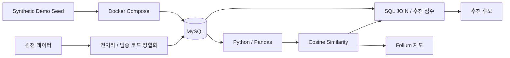
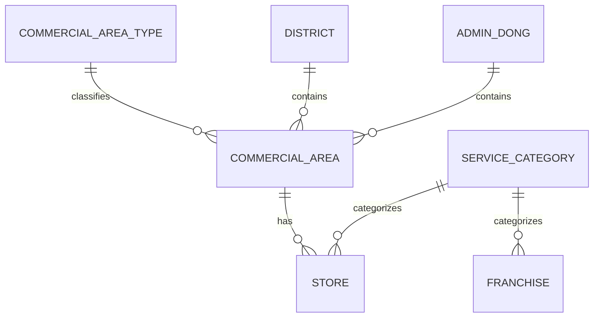

# Franchise Recommendation DB

서울시 상권 데이터와 프랜차이즈 정보를 관계형 데이터베이스로 연결하고, 입력 지역과 유사한 상권을 찾은 뒤 업종 성과와 프랜차이즈 지표를 결합해 후보를 추천하는 데이터 분석 프로젝트입니다.

## 1. 프로젝트 개요

| 항목 | 내용 |
| --- | --- |
| 프로젝트 | Franchise Recommendation DB |
| 기간 | 2023 |
| 형태 | 대학 데이터베이스 팀 프로젝트 |
| 핵심 주제 | 상권 데이터 모델링 및 유사 상권 기반 프랜차이즈 추천 |
| 주요 데이터 | 서울시 상권분석서비스, 공정거래위원회 가맹사업정보 |
| 실행 환경 | Jupyter Notebook / Python / MySQL / Docker Compose |

```text
공공·프랜차이즈 데이터 수집
→ 데이터 정제 및 업종 코드 정합화
→ 관계형 데이터베이스 설계·정규화
→ MySQL 테이블 구축 및 SQL 조회
→ 입력 지역 특성 벡터 구성
→ 코사인 유사도로 유사 상권 탐색
→ 업종 매출과 프랜차이즈 지표 결합
→ 추천 점수 계산 및 후보 출력
→ Folium 지도 시각화
```

공개 저장소에서는 원천 데이터를 재배포하지 않고, 동일한 데이터 구조를 따르는 **합성 Demo Seed와 Docker Compose 환경**을 통해 전체 흐름을 재현할 수 있도록 고도화했습니다.

## 2. 기획 의도

창업 후보지를 판단할 때 상권 특성과 프랜차이즈 정보를 따로 확인하면 지역·업종·브랜드 사이의 관계를 한 번에 비교하기 어렵습니다. 여러 출처의 데이터를 관계형 구조로 통합하고, 특정 지역과 비슷한 상권의 업종 성과를 이용해 프랜차이즈 후보를 좁히는 흐름을 구현했습니다.

- 상권, 점포, 업종, 프랜차이즈 정보를 공통 코드로 연결
- 함수 종속을 검토하고 반복 속성을 분리해 정규화
- SQL JOIN으로 지역·업종·프랜차이즈 데이터를 함께 조회
- 입력 지역과 기존 상권을 동일한 특성 공간에서 비교
- 코사인 유사도로 유사 상권을 탐색
- 매출·수익성·개점·해지·초기비용을 반영한 규칙 기반 점수로 후보 정렬

## 3. 주요 기능

### 데이터베이스 설계
- 상권, 행정동, 자치구, 상권 구분, 서비스 업종, 점포, 프랜차이즈 엔터티 설계
- PK/FK 기반 관계 정의
- 정규화 및 MySQL DDL 작성

### 상권·업종 데이터 조회
- 조건 검색, LIKE, NULL, 정렬, GROUP BY 집계
- 행정동·자치구·상권 간 JOIN
- 상권별 업종 매출 및 점포 수 조회

### 유사 상권 탐색
- 식별자·좌표를 제외한 수치형 특성 사용
- 결측치 보정
- 코사인 유사도 기준 유사 상권 탐색

### 프랜차이즈 추천
- 유사 상권 업종 매출과 프랜차이즈 정보 결합
- 당기순이익, 신규개점, 계약해지, 인테리어비, 교육비, 보증금, 기타비용 반영
- 휴리스틱 추천 점수 기준 정렬

### 공개 Demo 실행 환경
- Docker Compose 기반 MySQL 실행
- `schema.sql`과 `seed_demo.sql` 자동 초기화
- 별도 원천 데이터 없이 Demo Target Area 기준 분석 실행
- 실제 데이터 모드와 Demo 모드 분리

## 4. 기술 스택

| 영역 | 기술 |
| --- | --- |
| Language | Python, SQL |
| Database | MySQL 8 |
| Data Analysis | Pandas, NumPy |
| Similarity | scikit-learn cosine_similarity |
| Visualization | Folium, Matplotlib |
| Geospatial | pyproj |
| DB Connection | PyMySQL |
| Notebook | Jupyter Notebook |
| Runtime | Docker Compose |

## 5. 시스템 아키텍처



공개 저장소의 기본 실행 경로에서는 Docker Compose가 MySQL을 실행하고 `schema.sql`과 `seed_demo.sql`을 순서대로 적용합니다. Notebook은 합성된 `Demo Target Area`를 입력 지역으로 사용해 유사 상권 탐색부터 추천 후보 조회까지 수행합니다.

## 6. 추천 로직

추천은 **유사 상권 탐색**과 **프랜차이즈 후보 정렬** 두 단계로 구성됩니다.

### 1단계: 유사 상권 탐색

상권 통합 데이터에서 상권 코드·명칭·좌표·행정구역 코드 등 식별 목적 컬럼을 제외한 특성을 사용합니다.

```text
입력 지역 벡터
→ 결측치 보정
→ DB 상권 특성과 코사인 유사도 계산
→ 유사도가 높은 상권 선택
```

현재 구현은 원본 프로젝트 로직을 보존해 별도의 표준화 없이 수치 특성에 코사인 유사도를 적용합니다.

### 2단계: 프랜차이즈 후보 정렬

| 구분 | 반영 지표 |
| --- | --- |
| 긍정 요소 | 유사 상권 업종 매출, 당기순이익, 신규개점 |
| 비용·위험 요소 | 계약해지, 단위면적당 인테리어비, 교육비, 보증금, 기타비용 |

이 점수는 학습 모델의 예측값이 아니라 프로젝트 당시 정의한 규칙 기반 비교 점수입니다. Demo Notebook에서는 이 요소를 확인할 수 있도록 단순화한 점수식을 사용합니다.

상세 내용은 [추천 설계](docs/recommendation-design.md)에 정리되어 있습니다.

## 7. 데이터 수집 및 전처리

원 프로젝트에서 사용한 데이터는 다음 출처를 기반으로 구성했습니다.

- 서울 열린데이터광장: 상권, 매출, 점포, 인구, 소득·소비, 집객시설 등
- 공정거래위원회 가맹사업정보제공시스템: 프랜차이즈 재무·가맹·비용 지표
- 입력 지역 사례 데이터: 프로젝트 당시 별도 입력 파일 구성

원천 데이터와 가공 데이터는 공개 저장소에 포함하지 않습니다. 대신 `sql/seed_demo.sql`에 실제 상권·브랜드와 무관한 합성 데이터를 제공해 저장소만으로 실행 흐름을 검증할 수 있도록 구성했습니다.

## 8. 데이터 구조



| 테이블 | 역할 |
| --- | --- |
| 상권_구분 | 상권 분류 코드 |
| 자치구 | 자치구 코드·명 |
| 행정동 | 행정동 코드·명 |
| 상권정보 | 위치와 인구·소득·시설·점포 특성 |
| 서비스_업종 | 업종 코드·명 |
| 점포 | 상권-업종 단위 매출과 점포 수 |
| 프랜차이즈 | 브랜드 재무·가맹·비용 지표 |

전체 스키마는 [sql/schema.sql](sql/schema.sql), 설계 배경은 [데이터 모델](docs/data-model.md)에서 확인할 수 있습니다.

## 9. 프로젝트 구조

```text
Franchise_Recommendation_DB/
├─ notebooks/
│  └─ franchise_recommendation.ipynb
├─ sql/
│  ├─ schema.sql
│  ├─ seed_demo.sql
│  └─ sample_queries.sql
├─ data/
│  └─ README.md
├─ docs/
│  ├─ data-model.md
│  ├─ recommendation-design.md
│  ├─ demo-environment.md
│  └─ security-review.md
├─ compose.yaml
├─ .env.example
├─ .gitignore
├─ requirements.txt
└─ README.md
```

## 10. 실행 방법

공개 저장소는 **Demo 모드가 기본값**입니다.

### 1. MySQL Demo DB 실행

```bash
docker compose up -d
docker compose ps
```

처음 실행할 때 다음 순서로 DB가 초기화됩니다.

```text
sql/schema.sql
→ sql/seed_demo.sql
→ franchise_demo DB 생성
```

### 2. Python 환경 준비

```bash
python -m venv .venv
```

macOS / Linux:

```bash
source .venv/bin/activate
pip install -r requirements.txt
```

Windows PowerShell:

```powershell
.\.venv\Scripts\Activate.ps1
pip install -r requirements.txt
```

### 3. Notebook 실행

```bash
jupyter notebook notebooks/franchise_recommendation.ipynb
```

별도 환경변수를 설정하지 않아도 다음 Demo DB 설정을 기본으로 사용합니다.

```text
host=127.0.0.1
port=3306
database=franchise_demo
user=franchise
password=franchise
DATA_MODE=demo
```

### 4. Demo DB 재초기화

Seed를 변경했다면 MySQL 초기화 스크립트를 다시 적용하기 위해 볼륨을 제거합니다.

```bash
docker compose down -v
docker compose up -d
```

실제 데이터 환경으로 전환하는 방법은 [Demo 실행 환경](docs/demo-environment.md)을 참고합니다.

## 11. 검증

- 공개 Notebook의 JSON 구조와 Python 코드 흐름 정리
- DB credential 및 개인 PC 절대경로 제거
- Docker Compose에서 MySQL 스키마와 Demo Seed 자동 초기화
- Demo Target Area를 후보 상권에서 제외해 자기 자신이 유사 상권으로 선택되는 문제 방지
- Demo 데이터만으로 유사 상권 → 업종 성과 → 프랜차이즈 후보 조회 흐름 구성
- DDL의 FK 생성 순서를 참조 테이블 우선으로 정리

Demo Seed는 실행 재현을 위한 합성 데이터이며 원 프로젝트의 분석 결과를 재현하기 위한 데이터가 아닙니다.

## 12. 현재 범위와 한계

- 원천·가공 데이터는 저장소에 포함하지 않습니다.
- 공개 Demo 결과는 합성 데이터에 대한 실행 예시이며 실제 상권 분석 결과를 의미하지 않습니다.
- 유사도 계산 전 특성 표준화를 수행하지 않습니다.
- 결측치를 0으로 처리합니다.
- 추천 가중치는 학습값이 아닌 규칙 기반 값입니다.
- 창업 성공 확률이나 투자수익을 예측하는 모델이 아닙니다.

## 13. 관련 문서

- [데이터 모델](docs/data-model.md)
- [추천 설계](docs/recommendation-design.md)
- [Demo 실행 환경](docs/demo-environment.md)
- [공개본 보안 검토](docs/security-review.md)
- [입력 데이터 안내](data/README.md)
- [MySQL 스키마](sql/schema.sql)
- [Demo Seed](sql/seed_demo.sql)
- [SQL 예제](sql/sample_queries.sql)
