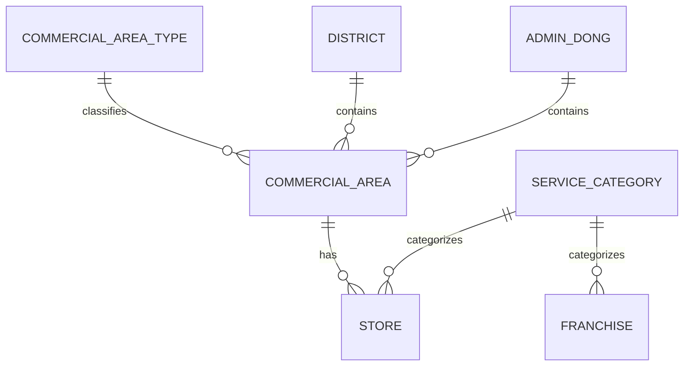

# 데이터 모델

## 1. 설계 목표

상권의 위치·인구·소득·시설 특성과 업종별 점포 성과, 프랜차이즈 정보를 하나의 관계형 구조로 연결하는 것이 목표입니다.

## 2. 엔터티

| 엔터티 | 식별자 | 핵심 내용 |
| --- | --- | --- |
| 상권 구분 | 상권 구분 코드 | 상권 유형 |
| 자치구 | 자치구 코드 | 자치구명 |
| 행정동 | 행정동 코드 | 행정동명 |
| 상권정보 | 상권 코드 | 좌표, 인구, 소득, 시설, 점포 특성 |
| 서비스 업종 | 서비스 업종 코드 | 업종명 |
| 점포 | 상권 코드 + 서비스 업종 코드 | 업종별 매출, 점포 수 |
| 프랜차이즈 | 등록번호 | 재무, 가맹, 비용 지표와 업종 코드 |

## 3. 관계

- 하나의 상권 구분에는 여러 상권이 속합니다.
- 하나의 자치구와 행정동에는 여러 상권이 존재할 수 있습니다.
- 상권과 서비스 업종의 조합으로 점포 집계 데이터를 식별합니다.
- 하나의 서비스 업종에는 여러 프랜차이즈가 연결될 수 있습니다.

## 4. 정규화

초기 설계에서는 상권 테이블에 행정동명, 자치구명, 상권 구분명처럼 코드에 종속되는 값이 함께 있었습니다. 이를 그대로 두면 코드와 명칭이 여러 행에 반복되고 갱신 이상이 발생할 수 있습니다.

따라서 다음 속성을 별도 테이블로 분리했습니다.

- `행정동_코드 → 행정동명`
- `자치구_코드 → 자치구명`
- `상권_구분_코드 → 상권_구분명`
- `서비스_업종_코드 → 서비스_업종명`

점포는 `(상권_코드, 서비스_업종_코드)` 복합키를 사용해 상권-업종 단위의 매출과 점포 수를 보관합니다. 프랜차이즈는 업종 코드를 FK로 두어 상권의 업종 성과와 연결할 수 있도록 구성했습니다.

## 5. 구현 참고

실행 가능한 생성 순서를 반영한 DDL은 [`../sql/schema.sql`](../sql/schema.sql)에 있습니다.
